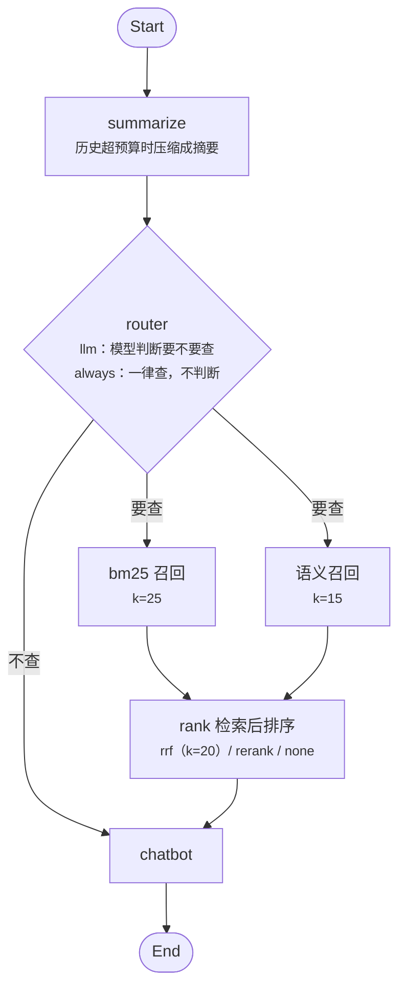

# RAG 问答图

```mermaid
graph TD
    Start([Start]) --> Summarize["summarize<br/><small>历史超预算时压缩成摘要</small>"]

    Summarize --> Router{"router<br/><small>llm：模型判断要不要查<br/>always：一律查，不判断</small>"}

    Router -- "要查" --> BM25["bm25 召回<br/><small>k=25</small>"]
    Router -- "要查" --> Semantic["语义召回<br/><small>k=15</small>"]
    Router -- "不查" --> Chat["chatbot"]

    BM25 --> Rank
    Semantic --> Rank

    Rank["rank 检索后排序<br/><small>rrf（k=20）/ rerank / none</small>"] --> Chat

    Chat --> End([End])
```

## 说明

router有参数: 是否判断检索: alawys, rule
rank有不同排序策略, rrf, rerank
